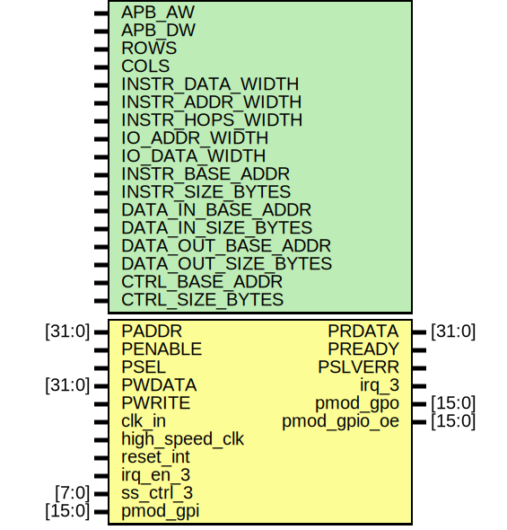

# src

This folder contains and organizes the local source files for a 16-point FFT implementation using a single SiLago cell.

Use Bender to generate file list.

For simulation:

```
bender -d ./tb script -t sim flist > hdl_files.list
```

For synthesis
```
bender -d ./tb script -t gf22 flist > hdl_files.list
```

## Entity: kth_ss 
- **File**: kth_ss.sv

## Diagram


## Generics

| Generic name        | Value         |
| ------------------- | ------------- |
| APB_AW              | 32            |
| APB_DW              | 32            |
| ROWS                | 1             |
| COLS                | 1             |
| INSTR_DATA_WIDTH    | 32            |
| INSTR_ADDR_WIDTH    | 6             |
| INSTR_HOPS_WIDTH    | 1             |
| IO_ADDR_WIDTH       | 2             |
| IO_DATA_WIDTH       | 256           |
| INSTR_BASE_ADDR     | 32'h0000_0000 |
| INSTR_SIZE_BYTES    | 256           |
| DATA_IN_BASE_ADDR   | 32'h0000_1000 |
| DATA_IN_SIZE_BYTES  | 96            |
| DATA_OUT_BASE_ADDR  | 32'h0000_2000 |
| DATA_OUT_SIZE_BYTES | 64            |
| CTRL_BASE_ADDR      | 32'h0000_3000 |
| CTRL_SIZE_BYTES     | 12            |

## Ports

| Port name      | Direction | Type   |
| -------------- | --------- | ------ |
| PADDR          | input     | [31:0] |
| PENABLE        | input     |        |
| PSEL           | input     |        |
| PWDATA         | input     | [31:0] |
| PWRITE         | input     |        |
| PRDATA         | output    | [31:0] |
| PREADY         | output    |        |
| PSLVERR        | output    |        |
| clk_in         | input     |        |
| high_speed_clk | input     |        |
| irq_3          | output    |        |
| reset_int      | input     |        |
| irq_en_3       | input     |        |
| ss_ctrl_3      | input     | [7:0]  |
| pmod_gpi       | input     | [15:0] |
| pmod_gpo       | output    | [15:0] |
| pmod_gpio_oe   | output    | [15:0] |